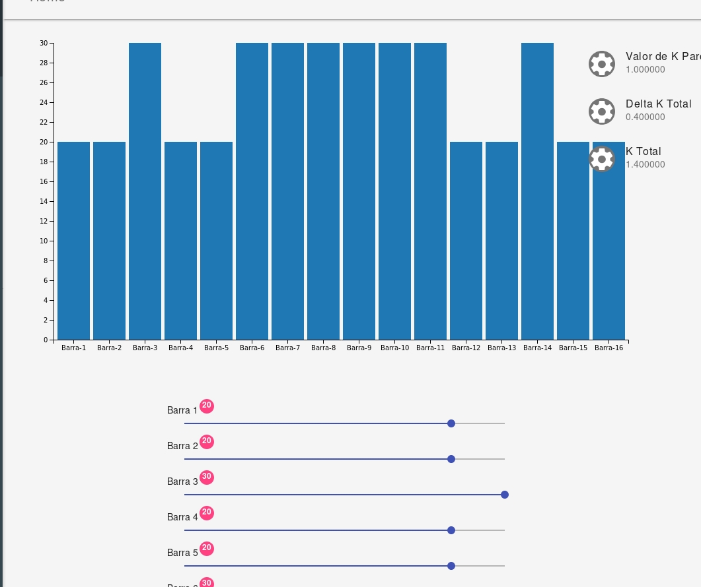
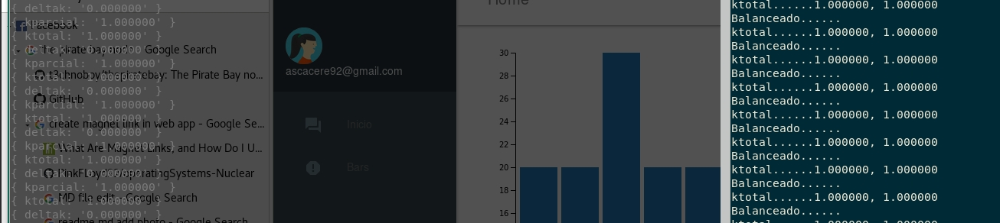

# Operating Systems - Nuclear Plant - bar's movement handler...

Basically I needed to simulate the movement of N bars that would change a value *k* selected by the user by the command line. The movement of each bar must be independent but there should be some kind of synchronization in order to check if the system is stable or not.

## Getting Started

You can check the following link in order to understand the 4 kinds of threads that are being used in the project

[Threads's diagram](https://docs.google.com/document/d/1q6NdU2xHc2Crykr7ovGfGrS9cffcxO6r7Vnw6KsQQQQ/edit?usp=sharing)

### Prerequisites

In order to see the UI you must have installed [npm](https://www.npmjs.com/get-npm) and [Node](https://nodejs.org/en/download/)installed in your computer. Also `gcc` and the library [curl](https://curl.haxx.se/download.html), and the library pthread

### Deployment

1. move to the folder `webapp`
2. Install the dependencies using `npm install`
3. Run the command `npm run start` and check the url `localhost:3000`
4. go to the folder src and run the command `make`, the just execute ./nuclear and enjoy!

## Screenshots

## Contributing

Please read [CONTRIBUTING.md](https://gist.github.com/PurpleBooth/b24679402957c63ec426) for details on our code of conduct, and the process for submitting pull requests to us.

## Versioning

We use [SemVer](http://semver.org/) for versioning. For the versions available, see the [operating systems, pthread](https://github.com/your/project/tags). 

## Authors

* **Andres Caceres** - *Operating Systems* - [Stackoverflow](https://stackoverflow.com/users/3347359/sebas)

See also the list of [contributors](https://github.com/your/project/contributors) who participated in this project.

## License

This project is licensed under the MIT License - see the [LICENSE.md](LICENSE.md) file for details
